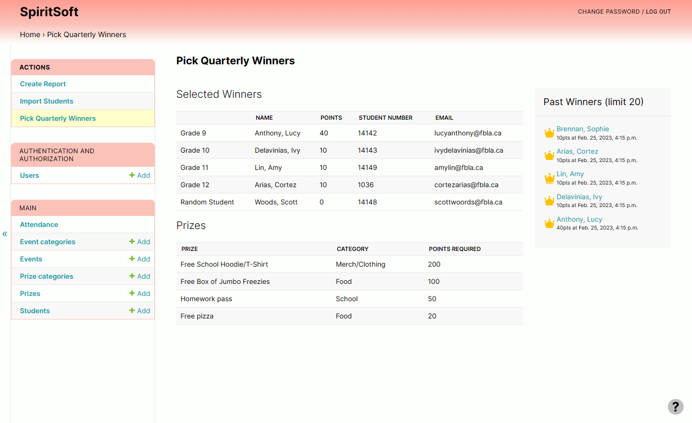

# SpiritSoft
### A simple yet revlutionary app tracking student participation and school spirit

SpiritSoft is designed to be easy to set up, easy to use, feature rich, and customizable for
school administrators, teachers, and groups.

## Demo
A **live demo** is available [here](https://spiritsoft.co/admin/login/) 
Username: `fbla` 
Password: `fblaadmin`

## Installation
SpiritSoft is distributed in two ways: a web version and a desktop app. You should use the web
version if you are a school and want multiple users to access the app, and the desktop app if you
are a single teacher with a small number of students.

The main difference between them is that the web version can be accessed by multiple users at the
same time and is run on a central school server, whereas the desktop version runs on a single
computer. Apart from this, the feature set of both versions are the same.

### Desktop App
Download the latest version [here](https://github.com/jdabtieu/fbla2023/releases). Extract the
zip file to a folder of your choosing, and once it's complete, you can launch SpiritSoft by double
clicking the SpiritSoft app.

### Web Version
To install the web version, please [email us](jonathan.wu3@outlook.com) to set it up in a secure
configuration for your school or school district.

## Features
### Ease of Use
SpiritSoft is designed with teachers and administrators first, with an extremely easy to use,
consistent, and intuitive design. An interactive help menu is also available to help users
navigate the platform.

### Comprehensive Power Tools
For administrators and advanced users, a multitude power tools are available. Import all students
with just two clicks in either CSV or PowerSchool format, update the attendance of multiple students
at once, and view action & winner history. As well, manual backups and fine-tuned editing can be
done with the import/export database tool.

### Customizable
Sort, search, and filter events and prizes into categories for easy organization. Quarterly winners
and reports can be picked and created with customization options: overall, per grade, or none.

### Leaderboard
Create a school leaderboard using the 'Create Report' feature to showcase to students to motivate
them!

### Standalone
No internet connection required for the desktop app, so you can update records on the school field
or on the go!

### Private and Secure
Configurable, dynamic, and secure backups are built into SpiritSoft's configuration. Depending on
corporate preference, automatic backups can be performed, whenever, whereever, on whatever schedule
is required. Manual backups can also be performed using the 'Export Data' page.

Additionally, all sensitive data is sent and stored securely and encrypted with industry-grade
encryption.
