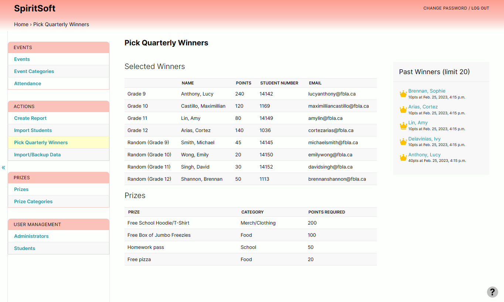

# SpiritSoft
### A simple yet revlutionary app tracking student participation and school spirit

SpiritSoft is designed to be easy to set up, easy to use, feature rich, and customizable for
school administrators, teachers, and groups.



## Installation
SpiritSoft is distributed in two ways: a web version and a desktop app. You should use the web
version if you are a school and want multiple users to access the app, and the desktop app if you
are a single teacher with a small number of students.

There are no core differences between them, other than the fact that the web version can be accessed
by multiple users at the same time and is run on a central school server, whereas the desktop
version runs on a single computer.

### Desktop App
Download the latest version [here](https://github.com/jdabtieu/fbla2023/releases). Extract the
zip file to a folder of your choosing, and once it's complete, you can launch SpiritSoft by double
clicking the SpiritSoft app.


### Web Version
A **live demo** of the web version is available [here](https://spiritsoft.co/admin/login/). To install the
web version, please [email us](jonathan.wu3@outlook.com) to set it up in a secure configuration for
your school or school district.


## Features
```
### Easy Installation
Although running FBLAquiz on a modern Linux distro is recommended, it runs on any modern version of
Windows, MacOS, and Linux. The only requirements are Python 3, and access to an administrator 
(root) account. More details can be found in [INSTALL.md](docs/INSTALL.md). The actual installation 
process is also very short and simple, taking at most 15 minutes, even on a slow office computer.

### Comprehensive Admin Tools
Admins of a site get access to a multitude of tools, including the ability to ban users or remotely 
reset passwords. Admins also get statistics on problems, such as the solve rate and number of 
submissions. As well, problems can be created, edited, and deleted at any time. All of these 
features can be accessed through the web interface. For more advanced admins, interacting with the 
database using sqlite3 is also possible, but not recommended.

### Fast and Lightweight
Users can get quiz results instantly after they submit. Fast and data-efficient, even on 3G 
connections.

### Personalized
Users can get personalized tips to help them perform better. By creating an account, users can save 
and view past quiz results, get access to detailed statistics, and get personalized training.

### Private and Secure
We take data security very seriously. We do not collect any data about you, the sysadmin, or any 
users. All data that users send to the site, including passwords and other form data are encrypted 
with industry-grade encryption. We also do not sell your data, and more information about how we 
handle user data is available in the Privacy Policy.
```

### More Features
- Ease of use
- Ease of installation
- Configurable backups
- Security
- No tracking/telemetry
- Data import
- Event and Prize categories
- Reports
- Leaderboard
- Customizable
- And more!
